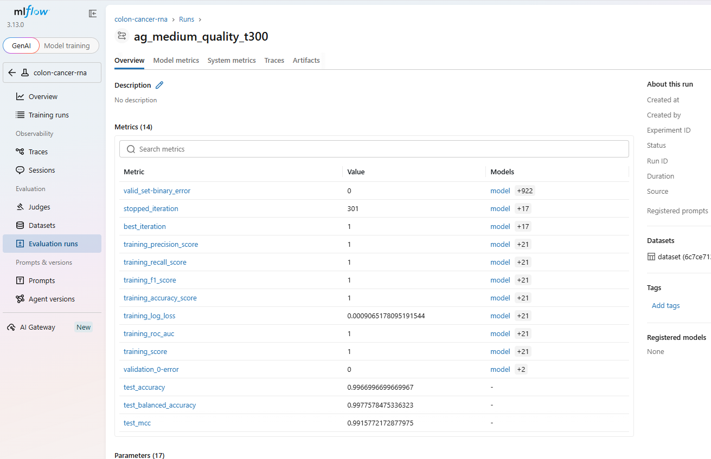

# Classification de stades du cancer colorectal par expression de RNA

Ce répertoire contient deux notebooks Jupyter qui analysent des données d'expression de RNA pour classifier des échantillons de cancer colorectal (stade **II** vs **control**).

> **Dataset :** PRJNA755688-stage12  
> **Labels :** `II` (cancer stade 2) et `control` (sain)

---

## Notebooks

### `generate4-ml.ipynb` — Approche sklearn manuelle

Notebook historique avec des classifieurs sklearn classiques.

**Pipeline :**
1. **Cellule 1** : Chargement et pivot des données RNA
2. **Cellules 2-3** : Vérification des labels et target
3. **Cellule 4** : Équilibrage des classes (undersampling pondéré)
4. **Cellule 5** : Réduction de dimension NCA + PCA (100% variance)
5. **Cellules 6** : Dimensions PCA
6. **Cellules 7-9** : Modèles ML sklearn (LogReg, SVC, Naive Bayes, RandomForest, KNN, BalancedRF)

**Points clés :**
- Modèles sklearn classiques avec hyperparamètres optimisés manuellement
- **Data leakage possible** : l'équilibrage est fait avant le split train/test
- Réduction NCA+PCA en amont du ML
- **Résultats** : Accuracy ~88-98% selon les modèles (données équilibrées)

---

### `generate5-ml.ipynb` — Approche AutoGluon (Moderne)

Notebook modernisé utilisant AutoGluon (AutoML) avec un pipeline anti-data-leakage.

**Pipeline :**
1. **Cellule 1** : Chargement et pivot des données RNA
2. **Cellules 2-3** : Vérification des labels et target
3. **Cellule 4** : **Split train/test AVANT équilibrage** + undersampling sur train uniquement
4. **Cellule 5** : Suppression de la colonne label
5. **Cellule 6** : Vérification des shapes
6. **Cellule 7** : Filtrage des features (≥20% d'expression + top 50 variance)
7. **Cellule 8** : AutoGluon medium\_quality **avec** PCA (NCA+PCA 95%)
8. **Cellule 9** : AutoGluon medium\_quality **sans** PCA (vrai test set réservé)
9. **Cellule 10** : AutoGluon medium\_quality étendu (600s, sans Ray)

**Points clés :**
- **Pas de data leakage** : split train/test avant équilibrage
- AutoGluon (LightGBM, CatBoost, XGBoost, RandomForest, NeuralNet…)
- Filtrage à 50 features maximum (top variance)
- Test set réservé dès le début (`X_test_final`, `y_test_final`)
- **Résultats** : Accuracy ~99% avec PCA, ~97% sans PCA

---

## Différences principales

| Aspect | `generate4` | `generate5` |
|--------|-------------|-------------|
| **Framework** | sklearn | AutoGluon |
| **Features** | 2653 (tous) | 50 (filtrés) |
| **Data leakage** | ❌ Possible | ✅ Évité |
| **PCA** | NCA + 100% variance | NCA + 95% variance (3 composantes) |
| **Test set** | Split dans la cellule ML | Réservé (cellule 4) |
| **Équilibrage** | Pondéré sur tout le dataset | Undersampling train uniquement |
| **Complexité** | Code long, répété | Code structuré, concis |

## Prérequis

```bash
pip install pandas numpy scikit-learn imbalanced-learn autogluon
```

> Note : `generate5` nécessite **AutoGluon** qui peut être lourd.  
> `generate4` nécessite **imbalanced-learn** (`pip install imbalanced-learn`).

---

## Tracking avec MLflow

Les scripts Python ci-dessous remplacent l'exécution manuelle des notebooks par des runs **trackés** avec MLflow.

### Fichiers

| Fichier | Rôle |
|---------|------|
| `mlflow_track.py` | Script principal : charge les données, entraîne AutoGluon, logue tout dans MLflow |
| `run_all.sh` | Lance plusieurs runs (medium_quality 300s, 600s, high_quality 600s) en séquence |

### Utilisation

```bash
# 1. Lancer un run unique
python mlflow_track.py --preset medium_quality --time-limit 300

# 2. Ou lancer la batterie complète
bash run_all.sh

# 3. Voir les résultats dans l'interface web
mlflow ui --port 5000
# Ouvrir http://localhost:5000
```

### Ce que MLflow enregistre

| Type | Exemples |
|------|----------|
| **Params** | `preset`, `time_limit`, `n_features`, `n_train`, `n_test` |
| **Metrics** | `test_accuracy`, `test_balanced_accuracy`, `test_mcc` |
| **Artéfacts** | `leaderboard.csv` (classement des modèles AutoGluon) |
| **Modèle** | AutoGluon `TabularPredictor` sauvegardé |

### Architecture MLflow

```
ColonCancer/
├── mlruns/               <- Base MLflow (créée automatiquement)
│   └── 0/
│       └── <run_id>/
│           ├── params/
│           ├── metrics/
│           └── artifacts/
├── mlflow_track.py       <- Script de tracking
├── run_all.sh             <- Batterie de runs
└── AutogluonModels/       <- Modèles AutoGluon (référencés par MLflow)
```

### Avantages par rapport aux notebooks

| Avant (notebooks) | Après (MLflow) |
|---|---|
| Dossiers `ag-2026...` sans contexte | Runs nommés (`ag_medium_quality_t300`) |
| Résultats copiés manuellement | Métriques comparables dans l'UI |
| Pas d'historique | Tous les runs conservés avec leurs params |
| Suppression manuelle (`find ... -exec rm`) | Cycle de vie MLflow (archive/delete) |

### Visualisation des résultats

[](./mlflow-result.png)

L'interface ci-dessus montre la comparaison des différents runs enregistrés par MLflow :
- **Paramètres** : chaque run enregistre le preset, le time limit, le nombre de features, etc.
- **Métriques** : `test_accuracy`, `test_balanced_accuracy`, `test_mcc` pour chaque run
- **Classement** : le `leaderboard.csv` listant les performances de chaque modèle AutoGluon

> 💡 Il est possible de filtrer/trier les runs par colonne et d'en sélectionner plusieurs pour superposer leurs métriques.